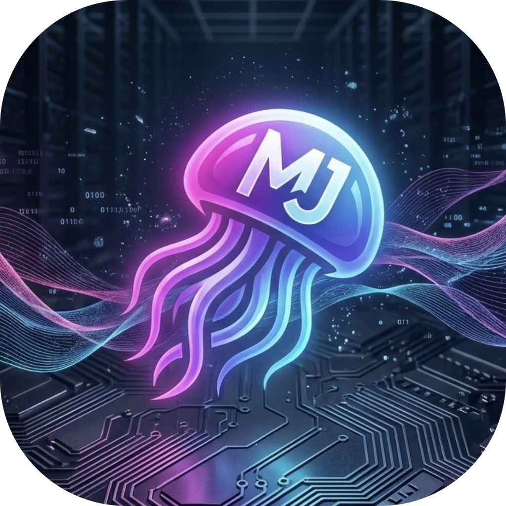

# Mitch-Jelly

<p align="center">
  
</p>

**A Modern, Streamlined Jellyfin Client built with Next.js**

Mitch-Jelly is a clean, modern Jellyfin client designed for speed, simplicity, and elegance. Born from the solid foundation of Aperture (originally built upon Finetic), Mitch-Jelly extends functionality with improved performance, watch status tracking, library management, and a customizable interface.

## Features

- **Rich Media Experience** — Native support for Video Backdrops, Theme Songs, and Trickplay thumbnails
- **Smart Connectivity** — Quick Connect login support and intelligent Direct Play/Transcoding selection
- **Watch Status Tracking** — Mark items watched/unwatched from anywhere: cards, episode lists, hero carousel, and detail pages
- **Advanced Library Support** — Collections (Box Sets), Live TV, paginated loading with infinite scroll for large libraries
- **Customizable Branding** — Admins can set a custom app name via Settings
- **Theming** — Multiple theme variations including "Cinematic Theatre Black", "Neon Grid", and more
- **Redesigned Playback Engine** — Seamless streaming aligned with Jellyfin best practices
- **Hero Media Bar** — Visually striking carousel showcasing highlighted content
- **Smart Episodic Features** — Intro and Outro skipping for effortless binge-watching (requires the Intro Skipper plugin)
- **Mini Player** — Keep watching while browsing with Picture-in-Picture mode
- **Seerr Integration** — Built-in support for Jellyseerr/Overseerr for content discovery and requests
- **Performance** — 5-minute local caching, skeleton loading, paginated fetches, and infinite scroll for snappy UX

## vs Jellyfin Web

| Feature | Jellyfin Web | Mitch-Jelly |
|---------|-------------|-------------|
| **Framework** | React + TypeScript | Next.js 16 + React 19 + TypeScript |
| **Performance** | Full page reloads | SPA navigation, instant transitions |
| **Loading UX** | Basic spinners | Skeleton loading, progressive rendering, infinite scroll |
| **Caching** | Browser cache only | 5-min localStorage + in-memory cache — instant revisits |
| **Browse view** | Grid with next/prev buttons | Grid with infinite scroll (200 items at a time) |
| **Sorting** | Server-side only | Client-side: Name, Date Added, Rating, Year, Runtime, Random |
| **Search** | Full text search | Type-ahead suggestions, `/` shortcut, 200-result limit + Seerr |
| **Watched badges** | Checkmark on cards | Checkmark + progress bars + "X left" episode counts |
| **Mark as watched** | Context menu on card | Hover eye-toggle on every card + episode scroller + hero + detail page |
| **Auto-mark watched** | Server-side at ~90% | Server-side + client-side fallback at >= 90% |
| **Themes** | Light + Dark | 11 themes (Cinematic Theatre Black, Neon Grid, Emerald Ember, etc.) |
| **Backdrops** | Static or blurred | Vibrant color-extracted aurora via WebGL |
| **Hero carousel** | No | Full-height hero with Ken Burns effect, logo extraction |
| **Mini player** | No | Picture-in-Picture while browsing |
| **Seerr integration** | No | Built-in — discover, request, and manage media via Jellyseerr/Overseerr |
| **Custom app name** | No | Admin-configurable branding (sidebar, browser tab, all UI text) |
| **Splash screen** | No | Cinematic splash loader |
| **Intro/Outro skipping** | Plugin | Built-in support with Intro Skipper plugin |
| **Desktop app** | Separate apps (MPV Desktop, JMP) | Native Electron app — Windows, macOS, Linux |
| **Docker** | Official image | GHCR image, manual `latest` or versioned release builds |
| **License** | GPL v2 | AGPL v3 |

## Built With

- **Frontend**: Next.js 16, React 19, TypeScript ~5.9
- **Styling**: Tailwind v4, shadcn/ui, Framer Motion
- **State Management**: Jotai
- **Package Manager**: Bun
- **Media Backend**: Jellyfin Server API, Jellyseerr/Overseerr API

## Getting Started

### Environment Variables

```env
DEFAULT_SERVER_URL=your_jellyfin_server_url
```

### Local Development

```bash
bun install
bun dev
```

Visit `http://localhost:3000` and sign in with your Jellyfin instance credentials. Hot reloading is enabled by default.

### Production Build

```bash
bun run build
bun start
```

### Docker

Pre-built images are available from GitHub Container Registry:

```bash
docker pull ghcr.io/mitchelljfranklin/mitch-jelly:latest
docker run -d -p 3000:3000 --name mitch-jelly --restart unless-stopped ghcr.io/mitchelljfranklin/mitch-jelly:latest
```

Or build locally:

```bash
docker build -t mitch-jelly .
docker run -d -p 3000:3000 --name mitch-jelly --restart unless-stopped mitch-jelly
```

Or with docker-compose:

```yaml
services:
  mitch-jelly:
    image: ghcr.io/mitchelljfranklin/mitch-jelly:latest
    ports:
      - "3000:3000"
    environment:
      - DEFAULT_SERVER_URL=${DEFAULT_SERVER_URL}
    restart: unless-stopped
```

### Desktop App (Electron)

Mitch-Jelly ships as a native desktop application for Windows, macOS, and Linux. The desktop app bundles the full Next.js production server — no Docker or external server needed. It runs entirely offline against your Jellyfin instance.

**Prerequisites:** Node.js (Electron ships its own copy, so no global Rust or native toolchains required).

#### Development

```bash
# Run Next.js dev server + Electron window (hot reload on both)
bun electron:dev
```

This starts `bun dev` on port 3000, waits for it to be ready, then opens an Electron window pointing at `http://localhost:3000`. DevTools are detached by default for debugging.

#### Building

```bash
# Build for your current platform (autodetected)
bun electron:build

# Build for a specific platform
bun electron:build:win     # Windows → dist-electron/*.exe (NSIS installer)
bun electron:build:mac     # macOS → dist-electron/*.dmg
bun electron:build:linux   # Linux → dist-electron/*.AppImage
```

Each command first runs `bun run build` (Next.js production build with `output: standalone`), then packages everything with `electron-builder`. Output goes to `dist-electron/`.

#### Installation

| Platform | File | Install |
|---|---|---|
| Windows | `dist-electron/Mitch-Jelly Setup x.x.x.exe` | Run the installer. Optional: choose install directory. |
| macOS | `dist-electron/Mitch-Jelly-x.x.x.dmg` | Open DMG, drag to Applications. |
| Linux | `dist-electron/Mitch-Jelly-x.x.x.AppImage` | `chmod +x` then run directly. |

#### Auto-Launch

The app can start automatically when you log into your OS. Toggle it from the Settings page inside the app (uses `electronAPI.setAutoLaunch()` IPC, backed by `app.setLoginItemSettings()` in the main process).

### Public HTTP Jellyfin Servers

Modern browsers block requests from HTTPS sites to public HTTP endpoints. To use Mitch-Jelly with a public server:

1. Add HTTPS to your Jellyfin instance (Let's Encrypt, reverse proxy, Cloudflare tunnel, etc.), or
2. Run Mitch-Jelly locally (bun dev, Docker) over HTTP

LAN/private IPs (192.168.x.x, 10.x.x.x, etc.) generally work over HTTP.

## Security

See [SECURITY.md](.github/SECURITY.md) for our security policy and vulnerability reporting process.

## Contributing

- [Report a bug](https://github.com/mitchelljfranklin/mitch-jelly/issues/new?template=bug_report.yml)
- [Request a feature](https://github.com/mitchelljfranklin/mitch-jelly/issues/new?template=feature_request.yml)

## Credits

Mitch-Jelly is based on [Aperture](https://github.com/akhilmulpurii/aperture) by Akhil Mulpuri, which was built upon [Finetic](https://github.com/AyaanZaveri/finetic) by Ayaan Zaveri.
